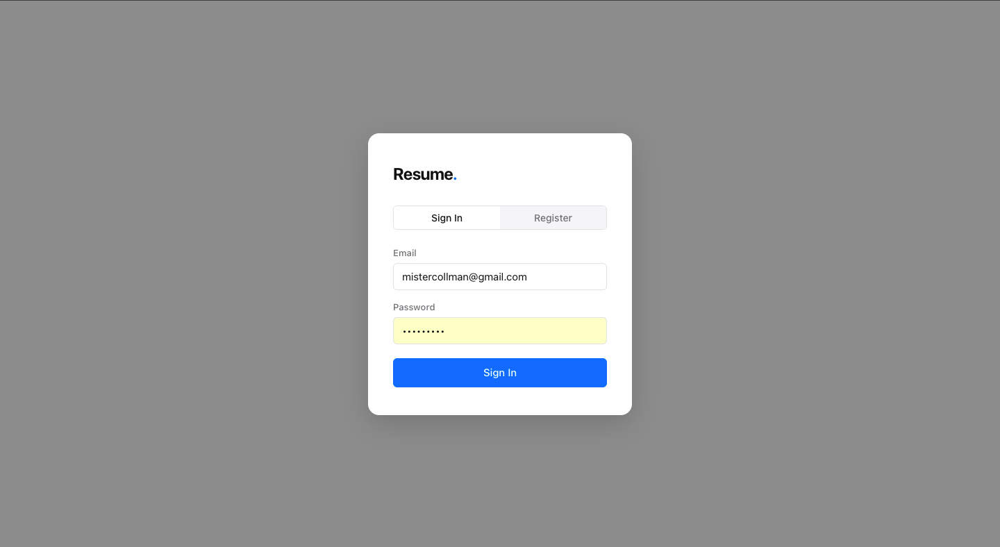
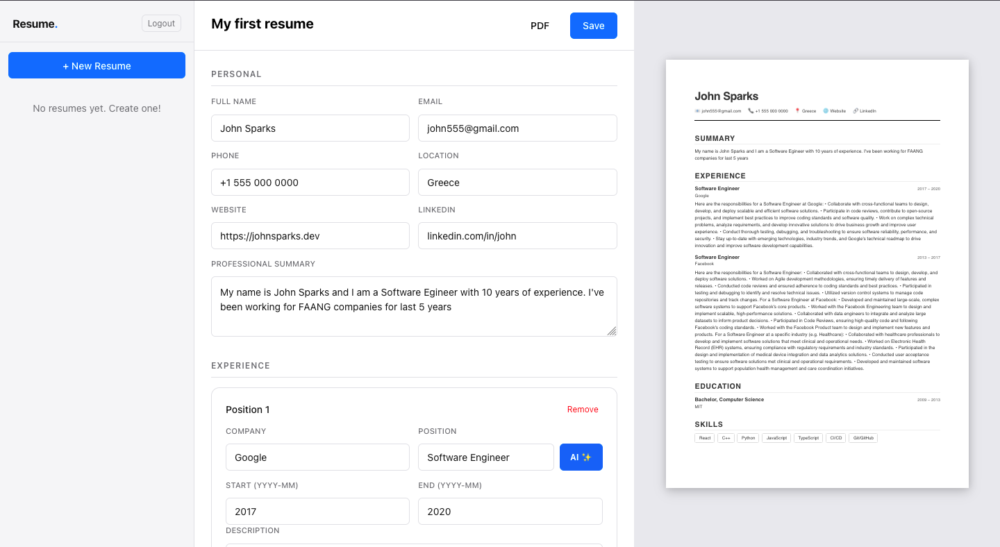
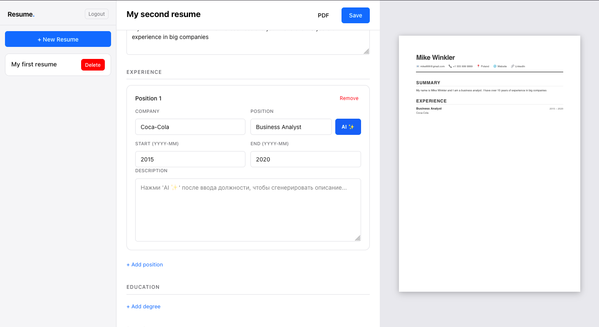
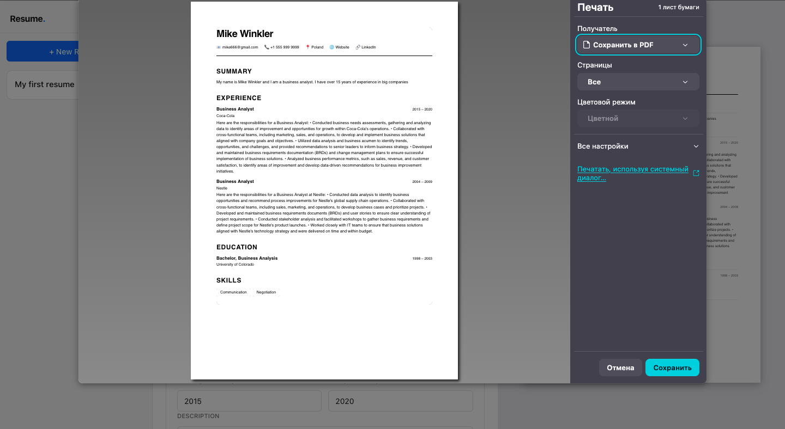
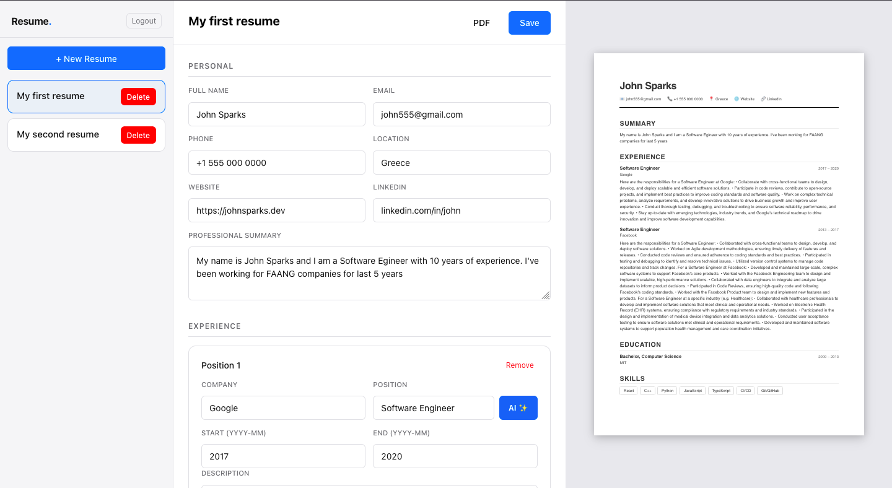

# Resume Builder — Frontend

React (CRA) + TypeScript + SCSS. No external UI libraries.

---

## Screenshots

### Register Page


### Main Page


### AI Feature


### PDF Downloading Page


### Resume List


---

## Project Structure

```
src/
├── api/
│   └── client.ts          # fetch wrapper: auth, JWT, 401 handler
├── components/
│   ├── AuthModal/
│   │   ├── index.tsx       # Login / Register modal
│   │   └── AuthModal.module.scss
│   ├── ResumeList/
│   │   ├── index.tsx       # Resume list in sidebar
│   │   └── ResumeList.module.scss
│   └── ResumePreview/
│       ├── index.tsx       # A4 live preview
│       └── ResumePreview.module.scss
├── pages/
│   └── EditorPage/
│       ├── index.tsx       # Main page (form + preview)
│       └── EditorPage.module.scss
├── styles/
│   └── global.scss        # Variables, reset, .btn, .field utilities
├── types/
│   └── index.ts           # User, Resume, WorkExperience, Education, Skill
├── App.tsx
└── index.tsx
```

---

## Getting Started

```bash
npm install
npm start
```

The FastAPI backend must be running at `http://127.0.0.1:8000`.

---

## Responsive Design

The app is fully responsive across all screen sizes:

| Breakpoint     | Width          | Layout                                      |
|----------------|----------------|---------------------------------------------|
| Desktop        | ≥ 1200px       | Sidebar + Form + A4 Preview (3 columns)     |
| Laptop         | 1000px–1199px  | Sidebar + Form (preview hidden)             |
| Tablet         | 768px–999px    | Sidebar collapses to top bar                |
| Mobile         | < 768px        | Single column, stacked fields               |

## Key Design Decisions

- **No external libraries** — plain `fetch`, React, TypeScript, and SCSS only.
- **JWT** is stored in `localStorage` under the key `resume_builder_token`. On a 401 response the token is removed and `unauthorizedCallback` fires → `AuthModal` is shown.
- **Auto-save**: `useDebounce` (900 ms) watches `draft`. If the resume has an `id`, changes are automatically persisted via `PUT /resumes/{id}`.
- **A4 preview** renders at `210mm × 297mm` and scales via `transform: scale()` based on viewport width — no iframes involved.
- **SCSS modules** per component + global utilities (`.btn`, `.field`) in `global.scss`.

---

## API Endpoints (FastAPI)

| Method | Path            | Description         |
|--------|-----------------|---------------------|
| POST   | /auth/token     | OAuth2 login → JWT  |
| POST   | /auth/register  | Register a new user |
| GET    | /users/me       | Get current user    |
| GET    | /resumes        | List all resumes    |
| POST   | /resumes        | Create a resume     |
| GET    | /resumes/{id}   | Get a single resume |
| PUT    | /resumes/{id}   | Update a resume     |
| DELETE | /resumes/{id}   | Delete a resume     |